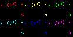

### Game Of Life

---




​     You must have heard about the famous game [Game Of Life](https://en.wikipedia.org/wiki/Conway%27s_Game_of_Life). So do you want to implement it by yourself and meantime practice your C programming skills ? Then spend some time on this tiny project. It only contains about 200 lines C code to create your own Game Of Life.

To see the results, first clone this project :

```
git clone https://github.com/PKUFlyingPig/GameOfLife.git
```

then choose one ppm format image you like and put it into testInputs/ folder(there are already some images in this directory).

then run ./frames.csh as follows :

```bash
./frames.csh <imagename> <rule> <frames> 
```

this script will use the image and the game rule you supply to create requested number of frames.

For example, to create the gif above, you can just run :

```bash
./frames.csh xkcd 0x1808 100
```

 So what does the rule mean? And how I can get started ?

In fact, this is a project of UCB CS61C, you can go to their [course website](https://cs61c.org/fa20/projects/proj1/) to get the start code and all the detailed guidence to finish your tiny GameOfLife !

